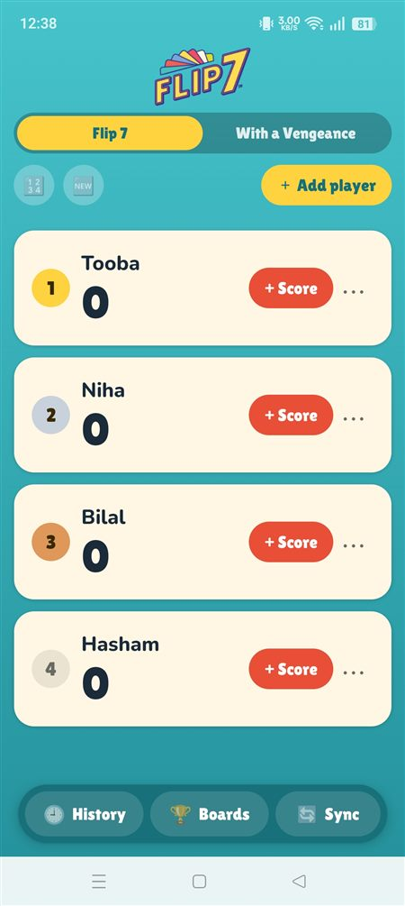
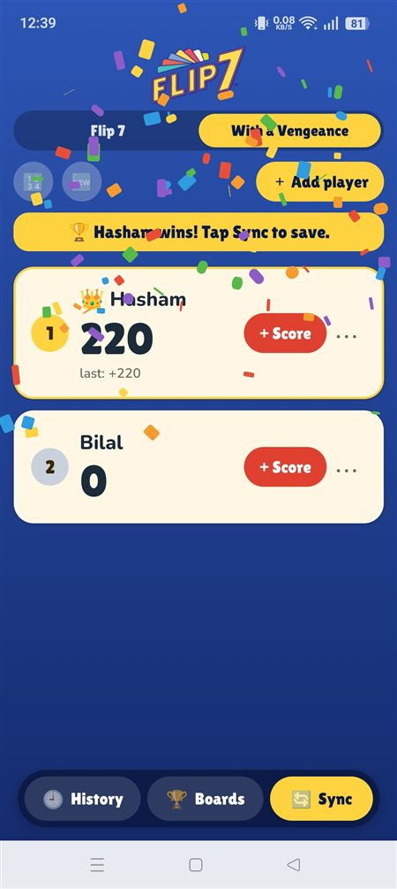
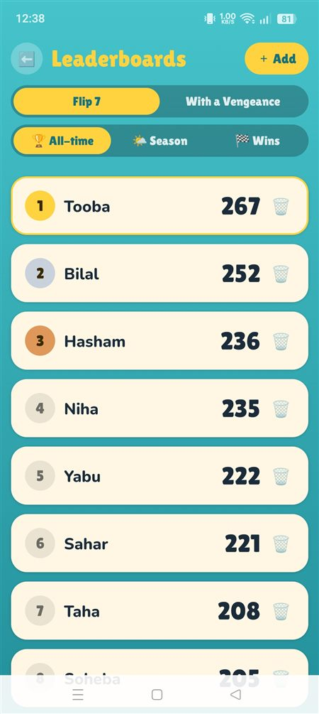
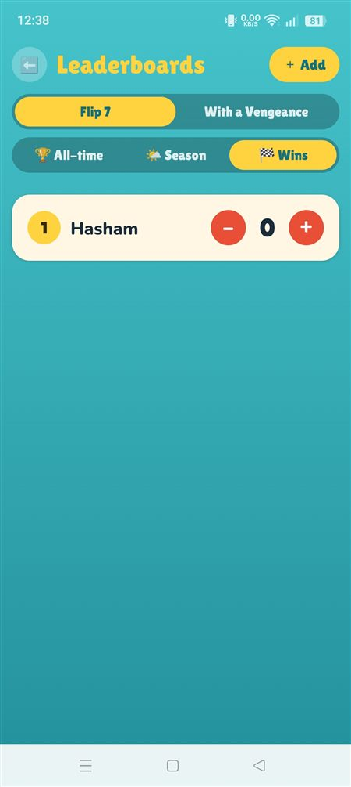
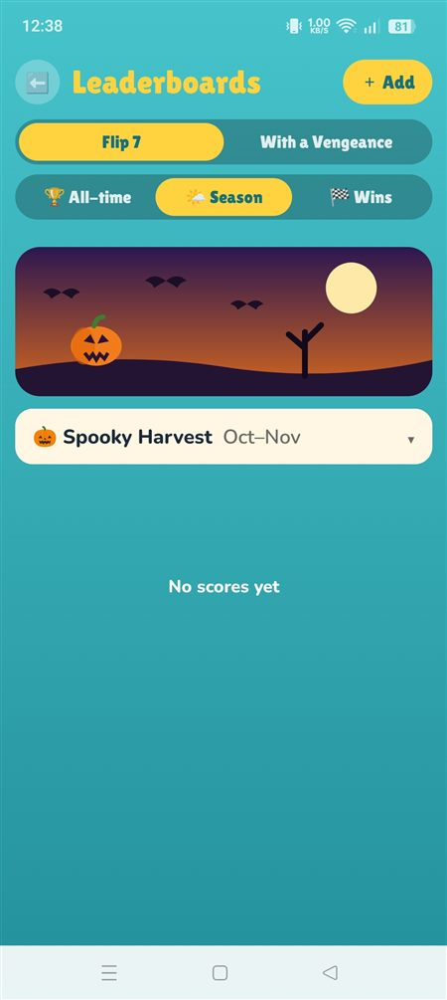
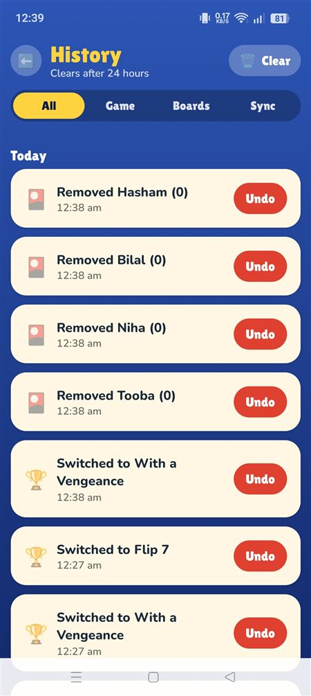

# 🎴 Flip 7 Scorer

**A scoring and game-management app for [Flip 7](https://theop.games/products/flip-7)** — the press-your-luck card game where the first to 200 wins.

Put the pen and paper away. Track every round, crown the winner with confetti, and keep leaderboards, seasons and win counts across game nights. Works for both **Flip 7** and **Flip 7: With a Vengeance**.

> 🃏 New to the game? Get it here: **https://theop.games/products/flip-7**

<p align="center">
  
  
  
</p>

---

## ✨ Features

### 🎯 Scoring
- Add players, rename them, remove them, reset a score, or start a **New game** with one tap
- Tap-to-score sheet that mirrors the real cards:
  - Number cards **0–13** plus **Lucky 13**
  - **×2** and **÷2** cards
  - **+2 … +10** and **−2 … −10** modifiers
  - **Flip 7 bonus (+15)**, added automatically when you select 7 number cards
  - A custom amount, positive or negative
- Live running total and a "score before → after" preview before you add it
- Sort by score or A–Z, with the leader wearing a 👑

### 🏆 Winning
- Hit **200** and a short confetti burst fires
- A banner names the winner (or winners, if tied) and prompts you to **Sync**

<p align="center">
  
</p>

### 🎭 Two editions
- Switch between **Flip 7** (teal) and **With a Vengeance** (blue) on the main screen
- Each edition has its own colors and its own separate leaderboards

### 📊 Leaderboards
- **All-time** — best score per player
- **Season** — scores for the current season
- **Wins** — win counts with quick **− / +** buttons
- Add, edit or delete entries by hand anytime

<p align="center">
  
  
</p>

### 🌤 Seasons
Six fixed two-month seasons, each with its own artwork:

| Months | Season |
|---|---|
| Dec–Jan | ❄️ Frosty Holidays |
| Feb–Mar | 💘 Love and Blossoms |
| Apr–May | 🌸 Spring Bloom |
| Jun–Jul | ☀️ Sunny Streak |
| Aug–Sep | 🎆 Firecracker Summer |
| Oct–Nov | 🎃 Spooky Harvest |

Switch between seasons from a dropdown to browse them. Scores stay in their season until you reset that season yourself.

<p align="center">
  
</p>

### 🔄 Sync
One tap takes the winner of the game and updates everything:
- **All-time** and **Season** scores are raised only if the new score is higher
- **Wins** goes up by one
- Names match regardless of **case and special characters** — `Hasham`, `hasham` and `HASHAM!` are the same player
- It uses the player's **current** name, so renaming Hasham to Tooba before syncing syncs Tooba
- Always writes to the **current calendar season**, whichever season you have open

### 🕘 History and undo
- Every change on every screen is logged: scores, renames, deletes, leaderboard edits and syncs
- **Undo** (and **Redo**) any entry, so an accidental delete or a wrong high score is easy to fix
- A sync undoes as a single step
- History clears itself after 24 hours

<p align="center">
  
</p>

### 🔒 Private and offline
- Everything is stored on your phone. No account, no internet, no tracking

---

## 🛠 Built with

- [Expo](https://expo.dev) (SDK 54) and React Native
- AsyncStorage for on-device saving
- `react-native-svg` for the season art
- Lilita One and Nunito fonts

## 🚀 Run it

```bash
npm install
npx expo start
```

Scan the QR code with Expo Go, or press `a` to open an Android emulator.

### Build an APK

Needs JDK 17 and the Android SDK.

```bash
cd android
./gradlew assembleRelease
```

The APK lands in `android/app/build/outputs/apk/release/`. It's built for 64-bit ARM phones only, which keeps it small (about 13 MB).

## 📁 Project layout

```
App.js                  Main screen
src/
  store.js              App state, saving, 24h history expiry
  ops.js                Reversible operations behind undo/redo
  sync.js               Winner sync logic
  names.js              Case/symbol-insensitive name matching
  theme.js              Edition color themes
  ScoringModal.js       The "+ Score" sheet
  cards.js              Card catalog
  screens/              Leaderboards, History
  components/           UI kit, confetti, season art
```

## ⚠️ Disclaimer

This is an unofficial fan-made scoring companion. It is not affiliated with or endorsed by the creators or publisher of Flip 7. Flip 7 is designed by Eric Olsen and published by The Op Games. Please support the game: **https://theop.games/products/flip-7**
